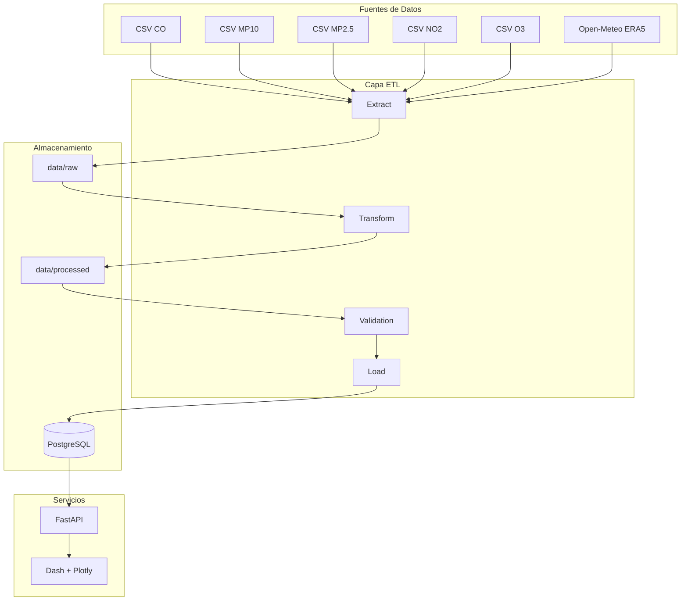

# Diagrama de Arquitectura

## Vista general

## Capas

1. **data_sources**: CSV y API meteorológica
2. **etl**: extracción, transformación, validación y carga
3. **validation**: Pydantic + Great Expectations
4. **postgresql**: almacenamiento normalizado
5. **fastapi**: exposición REST
6. **dash**: visualización interactiva (Dash + Plotly)

## Principios

- Separación por capas
- Dashboard consume solo API (no accede a DB)
- Pipeline reproducible con Docker
- Logging centralizado
