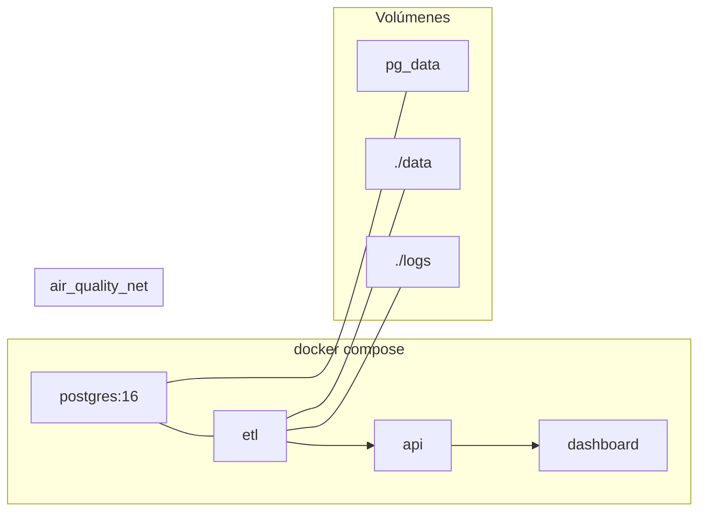

# Diagrama Docker

## Servicios

| Servicio | Imagen/Base | Puerto | Dependencia |
|----------|-------------|--------|-------------|
| postgres | postgres:16-alpine | 5432 | — |
| etl | python:3.12-slim | — | postgres healthy |
| api | python:3.12-slim | 8000 | etl completed |
| dashboard | python:3.12-slim | 8050 | api healthy |

## Red

Red bridge privada `air_quality_net`. Solo postgres, api y dashboard exponen puertos al host.
