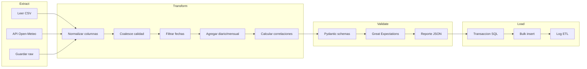

# Diagrama ETL

## Etapas

| Etapa | Módulo | Salida |
|-------|--------|--------|
| Extract | `etl/extract/` | `data/raw/{timestamp}/` |
| Transform | `etl/transform/` | `data/processed/*.parquet` |
| Validate | `etl/validation/` | `validation_reports/*.json` |
| Load | `etl/load/` | PostgreSQL |
