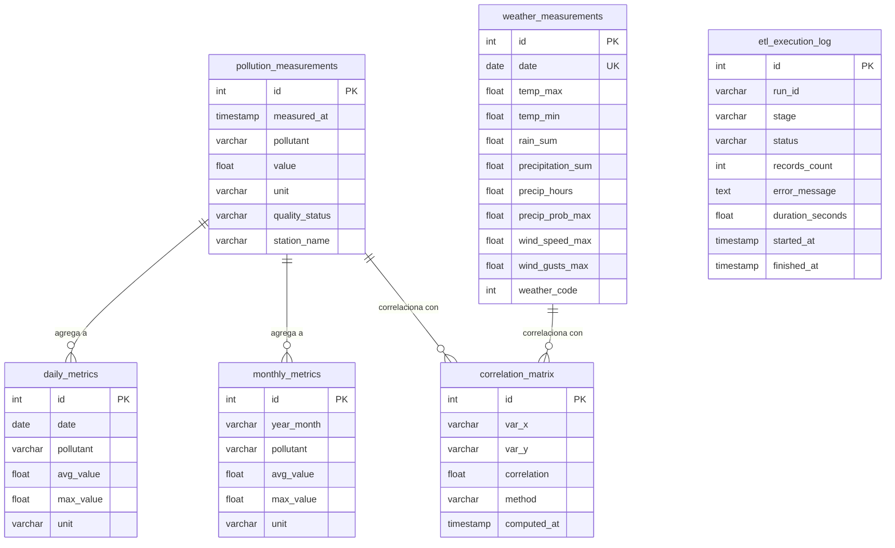

# Modelo Entidad-Relación

## Relaciones lógicas

- `daily_metrics` y `monthly_metrics` se derivan de `pollution_measurements`
- `correlation_matrix` cruza contaminantes con variables meteorológicas
- `etl_execution_log` registra cada ejecución del pipeline
